# Computer Graphics Lab For Jilin University

I have developed this experiment framework for update the labs of the Computer Graphics course, offered at Jilin University.

The framework comprises 14 concise exercises, guiding you through the process of creating 2D graphics and rendering 3D objects on your personal computer screen from scratch.

If you have any advice, please feel free to contact me. Let's work together to make the Computer Graphics more engaging and accessible.

## Environment

You should make sure your python environment has been set up firstly, and I suggest you using conda to create a pure python virtual environment. Then, you need to install denpendencies for our lab. `numpy` and `matplotlib` is all you need.
For example:

```
conda create -n graphics_lab python=3.10
conda activate graphics_lab
pip install numpy matplotlib
```

Secondly， you'll need a tool to run the `ipynb` file, such as jupyter notebook, vscode etc.

## Lab Contents

### Graphics 2D

1.  **Draw a Line**
2.  **Draw a Bézier Curve**
3.  **Draw a Rectangle**
4.  **Draw a Polygon**
5.  **Draw a Circle**
6.  **Fill Polygon with Color**
7.  **Fill Circle with Color**
8.  **Translation Transformation**
9.  **Rotation And Scale Transformation**

### Graphics 3D

The Graphics3D library is constructed as a pipeline:

10. **Complete MVP Processor**
11. **Complete Vertex Processor**
12. **Complete Rasterizer (Allows visualization of a 3D object)**
13. **Complete Lighting Processor (Implement Blinn-Phong Model)**
14. **Complete Texture Processor**

Additional instructions can be found in the `lab.ipynb` file.

## Examples

### Graphics 2D

#### straight line and Bézier Curve （exercise 1-2）

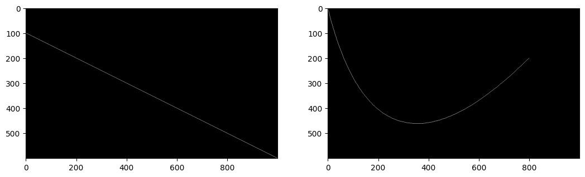

#### circle and polygon （exercise 3-7）

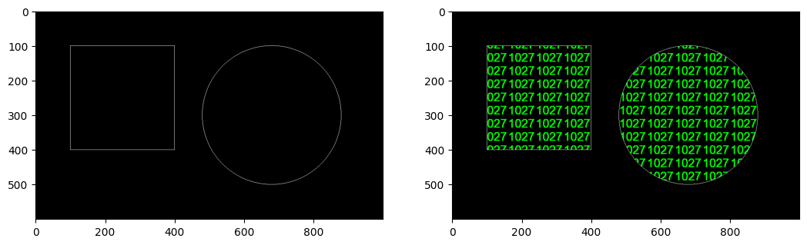

### translation transformation （exercise 8）

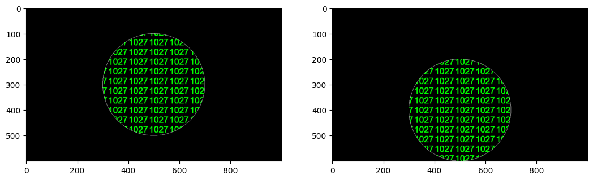

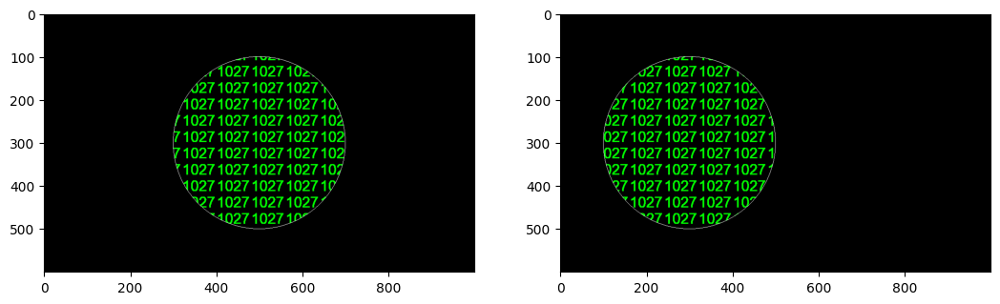

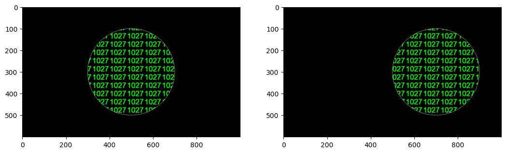

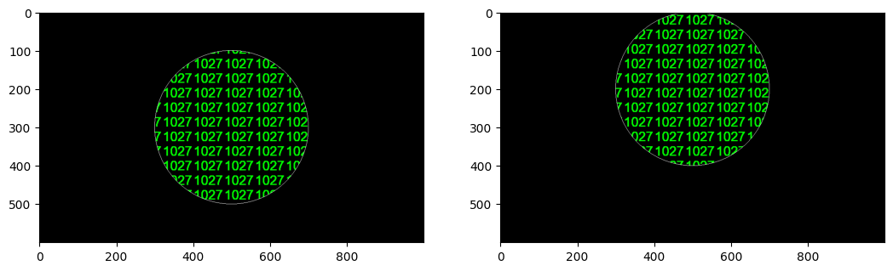

### rotation and scale transformation （exercise 9）

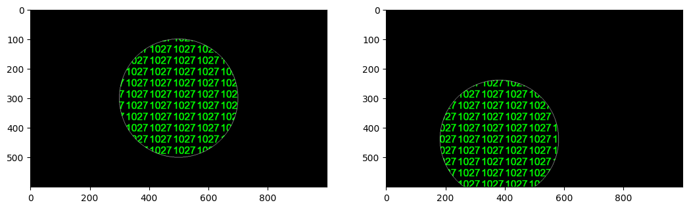

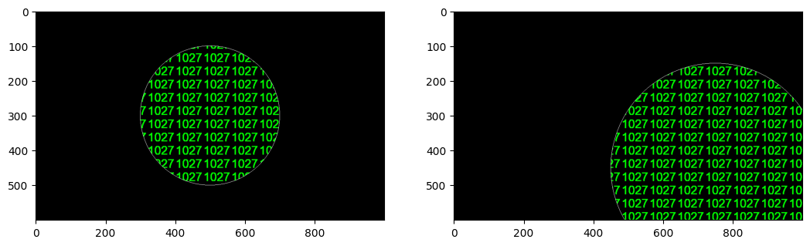

### Graphics 3D

#### Rasterize (exercise 12)

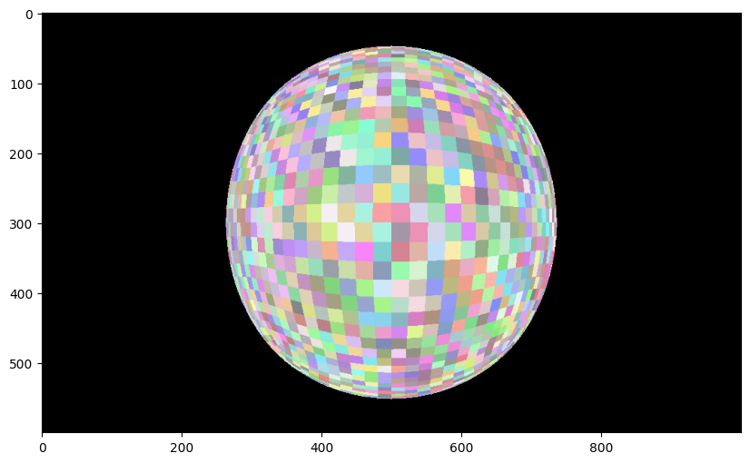

#### Blinn-Phong Lighting(exercise 13)

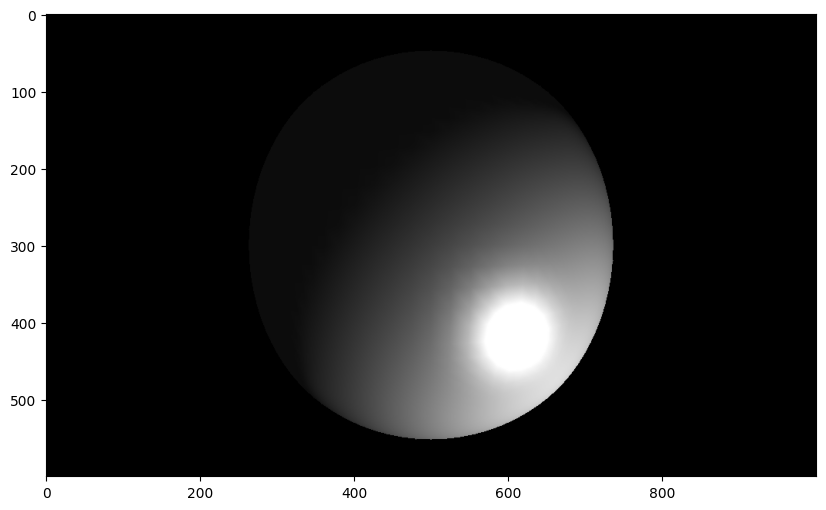

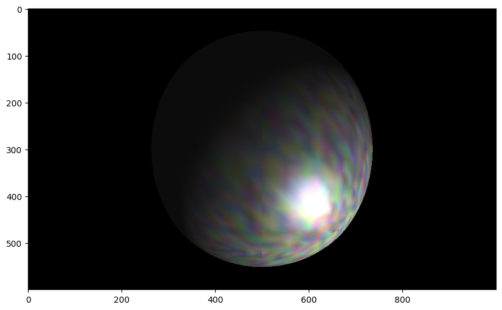

#### Texture (exercise 13)

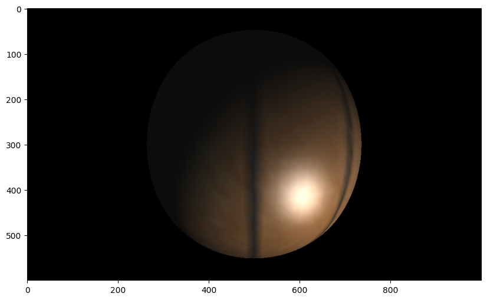

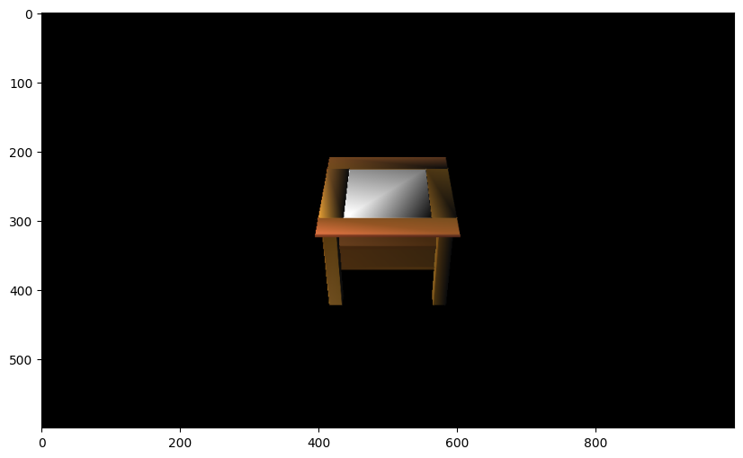
